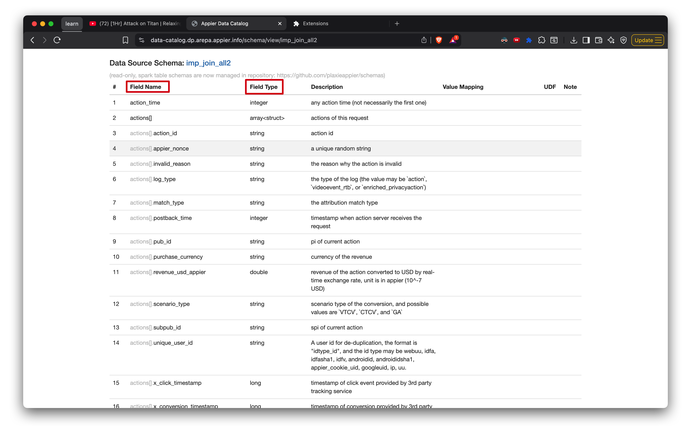

# Feature: Read table description web to get current existing field as default SELECT options

## Details

1. As  shown, Get the "Field Name" and "Field Type" as the `SELECT` field default options. => ability to parse the html and Get all "Field Name" and "Field Type"
2. If user hasn't login to this webpage will default fallback to default html => fallback mechanism
3. Some field will be duplicated with the  so we can use our customize field instead of the raw html data
4. the SELECT part drop down will show as "<Field Name> | <Field Type>". If the option is customize then show as "<Field Name> | Customize"
5. Auto-detect binary type fields and generate `BYTES2STR()` helper mappings:
   - Fields with `type === 'binary'` are automatically wrapped with `BYTES2STR()` function
   - These auto-generated helpers appear in the "Customize Fields" section with label "<Field Name> | BYTES2STR"
   - Binary fields already covered by manual `FIELD_MAPPINGS` (e.g., `bid_appier_id` → `bidobjid`) are excluded to avoid duplicates
   - Example: `app_id | BYTES2STR` generates `BYTES2STR(app_id) AS app_id`

## SELECT Dropdown Order

1. **Customize Fields** - Manual mappings from `fieldMappings.js` + auto-generated BYTES2STR helpers
2. **Other** - Custom free input option
3. **Schema Fields** - Raw fields from the data catalog

## Default fallback template

> [default template](../defaultSchema.js)
